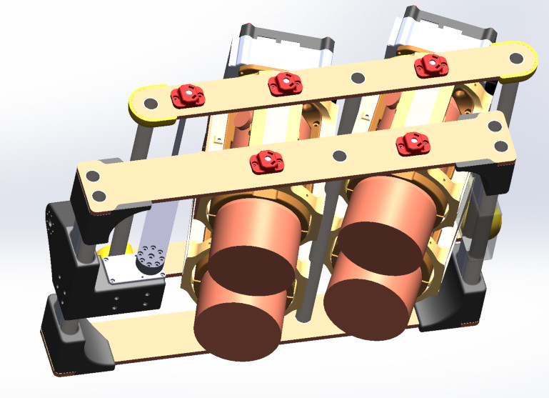
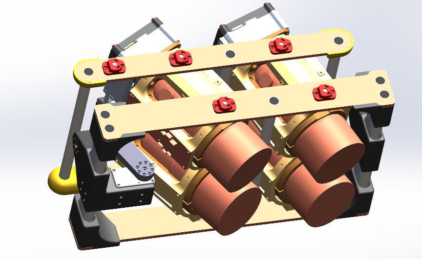
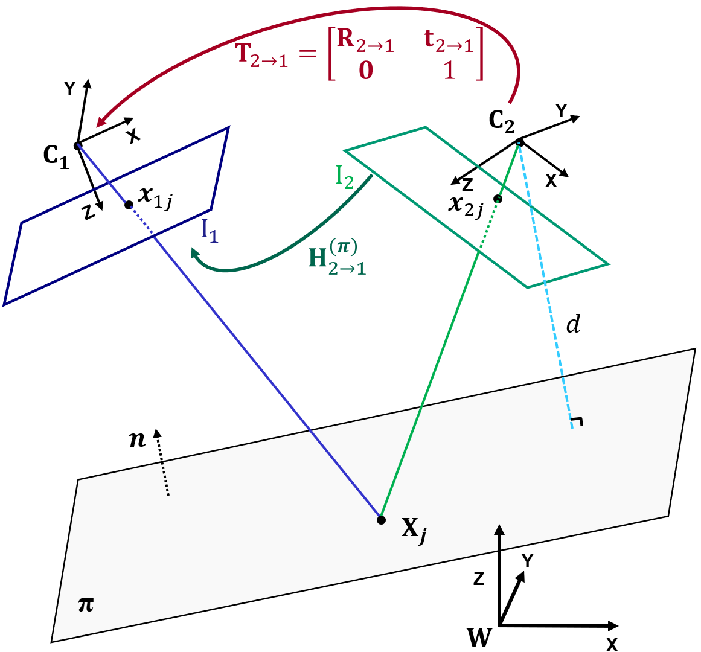
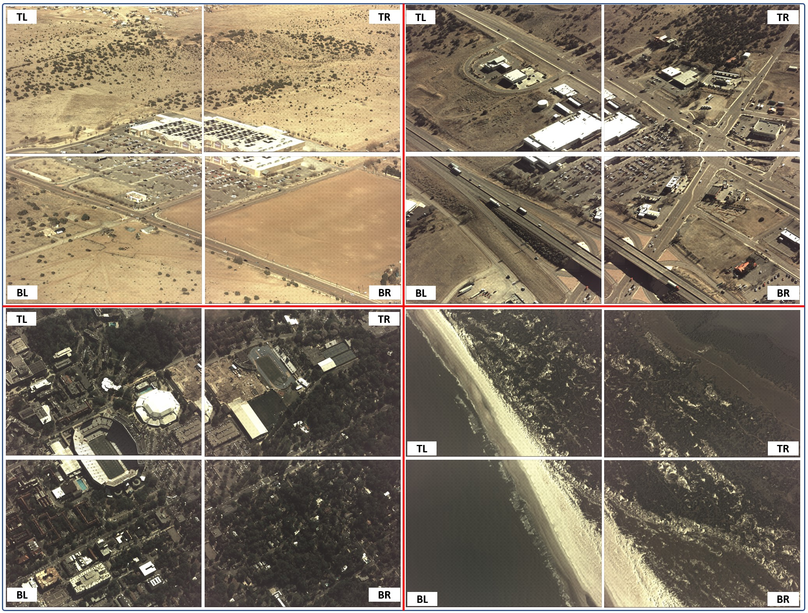
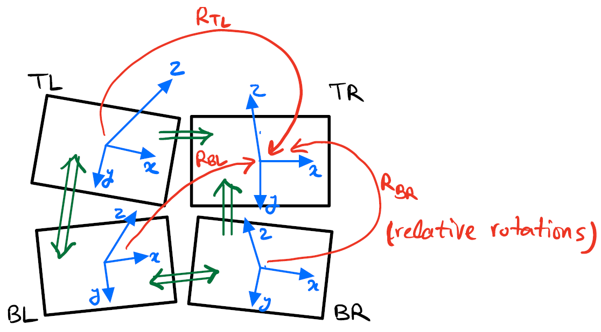

Figure 1. Diagram of stitching options in multi-camera Wide Area Motion Imagery (WAMI)

---

Figure 2. The four-camera WAMI system with a pinion gimbal.

---

Figure 3. Left: Plane induced homography between two cameras. An estimated homography in this case is only valid for this particular plane \\( \pi \\) (defined by its normal \\( \mathbf{n} \\) and distance \\( d \\). Right: Homography between two cameras that have only rotation components among their reference frames. This special case is known as \\( \textit{infinite homography} \\) which is, unlike a general homography, scene independent.

---

Figure 4. Raw sample frames used in our experiments. Left to right and top to bottom: Edgewood Walmart (New Mexico), Edgewood Smith's Pharmacy (New Mexico ), Gaineville (Florida) and  Matanzas Inlet (Florida). Each image in each dataset is labelled by \\( \textit{TL} \\) (Top-Left), \\( \textit{TR} \\) (Top-Right), \\( \textit{BL} \\) (Bottom-Left) and \\( \textit{BR} \\) (Bottom-Right).

---

Figure 5. Geometric representation of the cameras' coordinate systems (blue vectors) in a 4-camera setup. One of the camera's coordinate system (with no loss of generality, \\( \textit{TR} \\)) is assumed as the reference. The other cameras have their coordinate systems defined relative to the reference TR, each by a \\( 3\times3 \\) rotation matrix (red arrows).

---

