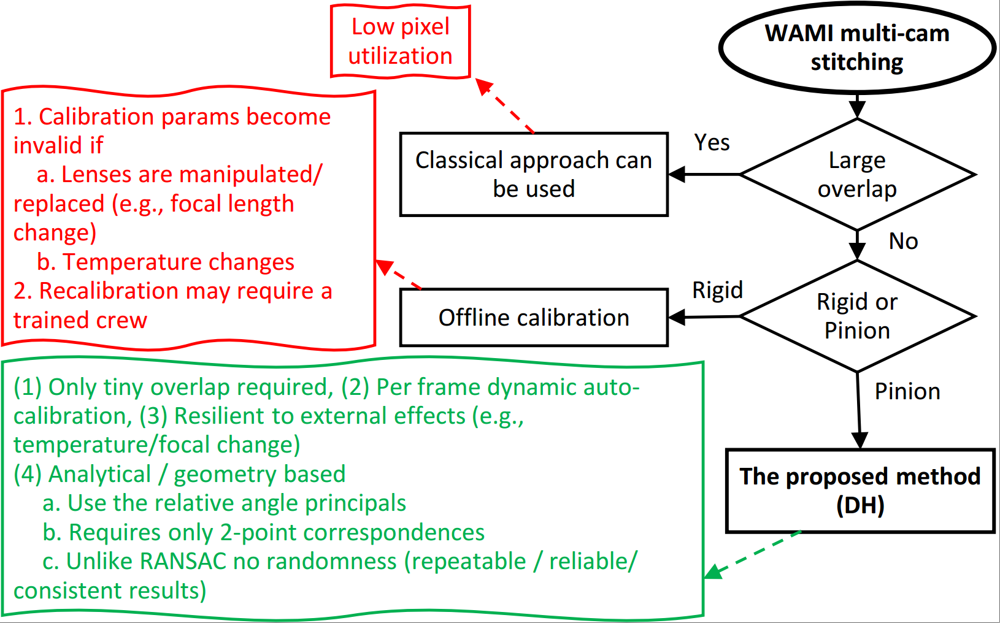
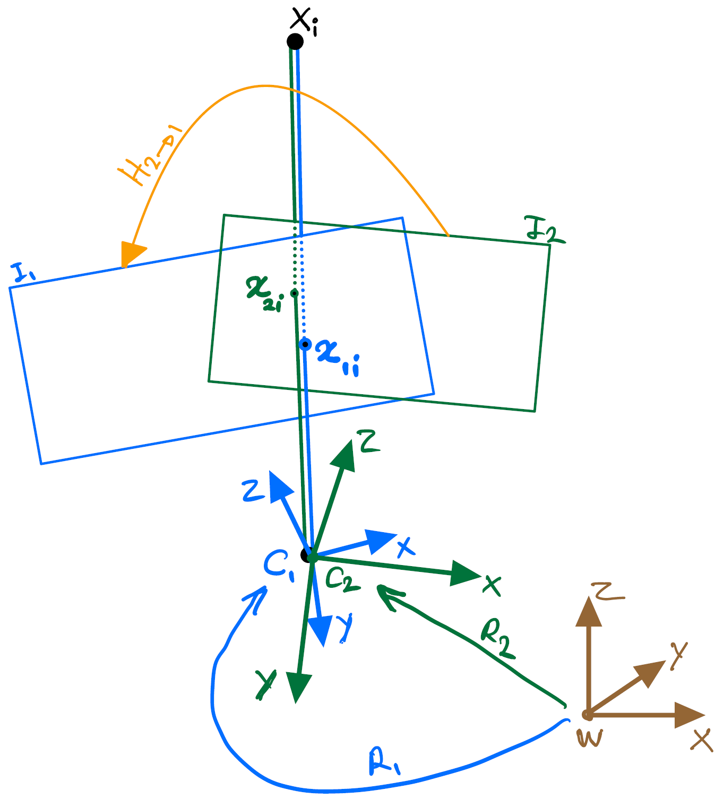

Figure 1. Diagram of stitching options in multi-camera Wide Area Motion Imagery (WAMI).

---

Figure 2. The four-camera WAMI system with a pinion gimbal.

---

Figure 3. Left: Plane induced homography between two cameras. An estimated homography in this case is only valid for this particular plane \\( \pi \\) (defined by its normal \\( \mathbf{n} \\) and distance \\( d \\). Right: Homography between two cameras that have only rotation components among their reference frames. This special case is known as \\( \textit{infinite homography} \\) which is, unlike a general homography, scene independent.

---

Figure 4. Raw sample frames used in our experiments. Left to right and top to bottom: Edgewood Walmart (New Mexico), Edgewood Smith's Pharmacy (New Mexico ), Gaineville (Florida) and  Matanzas Inlet (Florida). Each image in each dataset is labelled by \\( \textit{TL} \\) (Top-Left), \\( \textit{TR} \\) (Top-Right), \\( \textit{BL} \\) (Bottom-Left) and \\( \textit{BR} \\) (Bottom-Right).

---

Figure 5. Geometric representation of the cameras' coordinate systems (blue vectors) in a 4-camera setup. One of the camera's coordinate system (with no loss of generality, \\( \textit{TR} \\) ) is assumed as the reference. The other cameras have their coordinate systems defined relative to the reference TR, each by a \\( 3\times3 \\) rotation matrix (red arrows).

---

Figure 6. Results of the affine and DH homography estimations on Edgewood-Walmart dataset Top: Affine homography (\\( \mu=26.20 \\),\\( \sigma=31.08 \\) px), Bottom: DH (\\( \mu=2.23 \\), \\( \sigma=2.63 \\) px)

---

Figure 7. Results of the affine and DH homography estimations on Gainesville dataset.  Top: Affine homography (\\( \mu=66.09.47 \\),\\( \sigma=118.63 \\) px), Bottom: DH (\\( \mu=1.78 \\), \\( \sigma=1.87 \\) px)

---

Figure 8. Results of the affine and DH homography estimations on Matanzas Inlet dataset. Top: Affine homography when 3 feature point correspondences is used between the image pairs. (\\( \mu=426.94 \\),\\( \sigma=618.78 \\) px). Bottom: our DH algorithm when only 2 feature points are used. (\\( \mu=5.94 \\),\\( \sigma=3.70 \\) px).

---

Figure 9. Four camera image composition in the Gainesville dataset. Top: affine homography (\\( \mu=66.09 \\),\\( \sigma=118.63 \\) px). Bottom: The proposed DH method (\\( \mu=1.78 \\),\\( \sigma=1.87 \\) px). The region of interest is zoomed in and shown at the right of each result. Notice the duplication of the objects in the scene in the affine homography result.

---

Figure 10. Repeat-ability evaluation of the homography estimation methods.Top: affine, bottom: our DH method. Each estimation method is repeated 10 times over the identical set of point correspondences. The four corners of the final composed image in each case/iteration are plotted. The (x,y) std of the  bottom-left and bottom-right corners when the affine approach was used are (140.4698, 402.8796) px and (41.1020, 159.2288), respectively. The same std values for our approach are (0.1697, 0.0837) and (0.0921, 0.0046) px, respectively, when the proposed DH algorithm was used.

---

Walmart-Edgewood, NM. \\( \mu=53.75, \sigma=131.01 \\) Edgewood-Smith’s Pharmacy, NM. \\( \mu=97.19, \sigma=404.30 \\)

Figure 11. Images composed (each from 4 cameras) by perspective homography estimation. Mean and std of the errors for each case are displayed.

---

